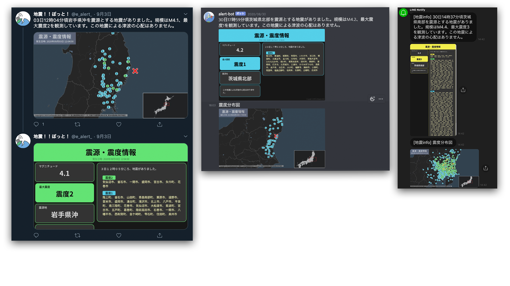

# Earthquake Alert

[](https://twitter.com/intent/follow?screen_name=e_alert_)


[🇯🇵](../README.md)| 🇺🇸



   ## tl;dr

   - Obtains earthquake information from the Japan Meteorological Agency, National Research Institute for Earth Science and Disaster Prevention, and others, and sends the formatted information to various platforms such as SNS.
   - Create seismic intensity distribution maps.

   ## 📢 Transmittable platforms

   - Discord (server web hook)
   - Slack (Slack bot)
   - LINE (LINE notify)
   - Twitter API

   ## 💬 Detailed specifications

   - For seismic intensity bulletins, only template-applied images are available. For information on the epicenter and seismic intensity, template-applied images and seismic intensity distribution maps will be sent.
   - The "minimum seismic intensity to be sent" and "target area" can be specified separately for multiple platforms.
   - No other dependencies need to be installed at the time of deployment because everything runs on Docker.

   ## 🚀 Move it.

   **Git and Docker must be installed. **

   Be sure to download via git.

   ```bash
   git clone https://github.com/earthquake-alert/earthquake-alert.git
   ```

   Check the version of [chrome-driver](#-about chrome-driver) and optionally change it to the one that supports the latest version of Chrome.

   ```bash
   # update submodules
    sh build/init_submodule.sh

   # run
    docker-compose up -d

   # Check logs
    docker-compose logs -f

   # pause docker-compose
    docker-compose stop

   # restart
    docker-compose up -d

   # stop (also remove containers)
    docker-compose down
   ````

   ## ⚠ About chrome driver

   Chrome gets the latest version when it is built. Therefore, chrome-driver must always be the right version for the latest version of Chrome. \ \
   Copy the download link for the chrome-driver corresponding to the latest version from the following site and copy [Dockerfile](./Dockerfile)e and change the link in **ADD** in the `install ChromeDriver` section.

   [Index of chrome-driver](https://chromedriver.storage.googleapis.com/index.html)

   ## 📝 How to write a configuration file

   The configuration file is synchronized with the Docker container. \
   If you want to add a new configuration, please pause it with `docker-compose stop` before adding it. \
   Any new additions or changes will first have the configuration sent to each platform.

   [Writing configuration files].(documents/hou_to_setting.md)

   ## 🔰 Coding Rules

   [Python coding rules](documents/python_rule.md)

   ## ⚖ License

   [MIT LICENSE](LICENSE)
